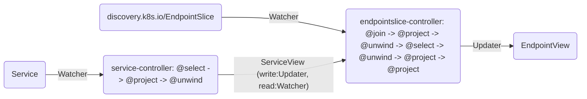

# Concepts: Operators, Controllers and Objects

In Δ-controller, the terms "Operator", "Controller" and "Object" come with a specific meaning that is crucial to understand. While closely related, they represent different layers of abstraction. To use a more familiar example, think of an **Operator** as a complete RESTd-based microservice, **Controllers** as the specific HTTP/REST handler within that application, and **Object** as an REST API resource that the microservice serves and acts upon.

## The Operator: A Container for Automation

In Δ-controller, an **Operator** is the primary custom resource you create and manage with `kubectl`, or instantiate from Go code if so you wish (see later on "hybrid operators"). The operator acts as a logical container that groups together one or more related controllers to achieve a complete automation goal.

An **Operator** is defined in a cluster-scope custom resource (CR). An operator is defined by a unique `name`, a list of **Controllers** with one or more controller definitions that collectively form the operator's business logic, and a set of **views**, which are the internal Kubernetes object-like resources storing temporary internal state. When you `kubectl-apply` an `Operator` manifest, the central Δ-controller manager brings your automation to life by starting the controllers defined within it. When you delete the `Operator` CR, all its associated controllers are gracefully shut down and the view store is wiped. In essence, the `Operator` CR is the **unit of deployment and lifecycle management** for your automation logic.

A minimal `Operator` structure looks like this:

```yaml
apiVersion: dcontroller.io/v1alpha1
kind: Operator
metadata:
  name: my-automation-operator
spec:
  controllers:
    - # <-- Controller definition 1 goes here
    - # <-- Controller definition 2 goes here
    - # ... and so on
```

Use lower-case alphanumeric characters and dashes for the operator name and in general try to keep it short, otherwise you'll have to type a lot when using the embedded extension API server (see later).

## The Controller: The Engine of a Data Pipeline

A **Controller** is the true workhorse in the Δ-controller framework. It defines a single, directional data-processing pipeline. Each controller is a self-contained unit of logic that specifies:

1.  **Sources**: Sources define the data store that the controller should watch for changes (deltas). Sources can be native Kubernetes resources (like `Pods`, `Services`, `EndpointSlices`) or internal, custom **views** created by other controllers.
2.  **Pipeline**: The pipeline defines what a controller should do with the data. A pipeline is a declarative series of data processing steps that filter, transform, combine, and reshape the data from the sources, using operators like `@join`, `@project`, and `@select`. This is where the core logic of your automation resides.
3.  **Target**: Targets define where the result should go. The output of the pipeline is written to a single target resource. This target can be a native Kubernetes resource (to which the output is applied as a patch or an update) or an internal **view** to pass data to another controller.

A Controller is defined within the `spec.controllers` array of an `Operator`:

```yaml
...
spec:
  controllers:
    - name: my-specific-controller
      sources:
        - # Source 1: e.g., watch for Services
        - # Source 2: e.g., watch for EndpointSlices
      pipeline:
        # The aggregation and transformation logic
      target:
        # The destination for the pipeline's output
...
```

## Object Model: Universal and Schemaless

Δ-controller operates on a universal, schemaless **object** model. Internally, all Kubernetes resources, whether they are built-in types like `Pods` and `Services`, your own Custom Resources, or Δ-controller's internal views, are treated as "unstructured" objects. In Go speak, objects are represented as flexible key-value structures (a `map[string]any` structure in Go speak), just like their raw YAML or JSON counterparts. This design choice is fundamental to the framework's power, as it allows you to write controllers that operate on *any* resource kind without needing to import specific Go type definitions or recompile the controller.

Because every object is just unstructured data, the entire pipeline and expression language is built around manipulating this data directly. You use JSONPath expressions to navigate and extract values (e.g., `$.spec.replicas`), and operators like `@project` to construct new object shapes dynamically. This approach trades the compile-time type safety of Go structs for the runtime flexibility of a dynamic, document-oriented model, reinforcing the core concept of treating the Kubernetes API as a queryable database. However, this model also comes with certain risks, as there are no API promises for Δ-controller objects apart from the pipeline logic that generates them.

## Visualizing Operators

Complex operators with multiple controllers and views can be difficult to understand from the YAML specification alone. Δ-controller provides the `dctl visualize` command to generate visual diagrams showing the data flow through your operator.

The command accepts either a complete `Operator` CRD or just the `controllers` list (an `OperatorSpec`) and generates a flow diagram:
- Generate Mermaid diagram (default)
  ```bash
  dctl visualize operator.yaml
  ```
- Save to file:
  ```bash
  dctl visualize operator.yaml --output diagram.md
  ```
- Generate Graphviz DOT format:
  ```bash
  dctl visualize operator.yaml --format dot
  ```

As an example, consider the [endpointslice-operator](../examples/endpointslice-controller/endpointslice-operator.yaml), which implements a custom EndpointSlice controller with two stages. Running `dctl visualize` on this operator produces:


